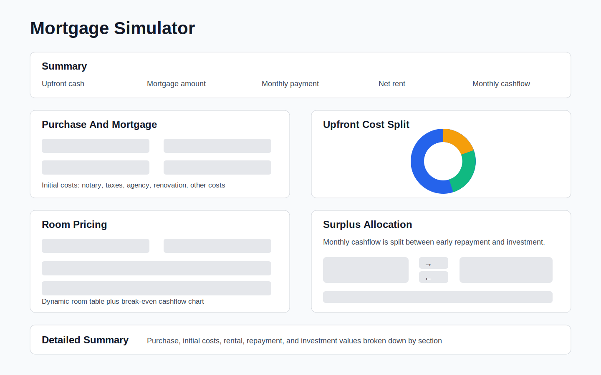

# Mortgage Simulator

A Streamlit app for exploring mortgage affordability, rental room pricing, early repayment, and investment tradeoffs for a rented property.



## What It Does

The app models a property purchase with a mortgage and rented rooms. It lets you tune the main financial assumptions directly on the page, then shows how much monthly cashflow remains after rent, taxes, mortgage payments, and operating costs.

That expendable cashflow can be split between:

- early mortgage repayment
- monthly investment at an alternative annual return

The repayment/investment split always totals 100%.

## Run Locally

```bash
pip install -r requirements.txt
streamlit run main.py
```

## Run Tests

```bash
make test
```

## Main Sections

### Summary

Shows the key numbers for the current scenario:

- upfront cash needed
- mortgage amount
- monthly mortgage payment
- net rent
- monthly cashflow after mortgage and operating costs

### Purchase And Mortgage

Contains the core purchase assumptions:

- house price
- mortgage percentage
- annual interest rate
- mortgage duration
- grouped initial purchase costs for professional fees, bank fees and taxes, property setup, and other upfront costs

Notary and agency costs can be entered either as fixed euro amounts or as percentages of the house price.

The nearby pie chart shows how upfront cash is split across down payment and initial costs.

### Room Pricing

Models the rental side of the property:

- quick rental estimate for gross rent, net rent, and monthly operating costs
- expected occupancy
- rental tax rate
- monthly operating costs
- a dynamic room-rent table with editable room labels

The room table supports any number of rooms. Add or remove rows to change the room count. Empty room labels are automatically filled as `Room 1`, `Room 2`, and so on. The break-even chart shows monthly cashflow by number of rented rooms.

### Surplus Allocation

Uses only expendable monthly cashflow:

```text
net rent - mortgage payment - monthly operating costs
```

That amount is split between extra mortgage principal and investment. The arrow buttons move the allocation:

- normal click: 5 percentage points
- Shift-click: 15 percentage points
- Ctrl-click or Cmd-click: 30 percentage points

The alternative annual return is editable next to the invested-surplus value. One-off repayment events can also be added in the table by entering the year and extra repayment amount.

### Repayment Chart

Compares the base mortgage balance with the selected combined strategy. The strategy assumes:

- the normal mortgage payment is always paid
- operating costs are covered first
- the selected repayment share is applied as recurring extra principal
- the remaining monthly cashflow is invested
- one-off repayment events are applied at the selected year

### Detailed Summary

Breaks the scenario into readable sections:

- purchase
- initial costs
- rental
- repayment and investment

Use this section to audit the exact values behind the charts and headline metrics.

## Project Structure

```text
main.py       Streamlit UI and orchestration
charts.py     Plotly chart builders
documentation.py Streamlit formulas and references section
formatting.py Money display helpers
investment.py Repayment-vs-investment strategy and scenario helpers
models.py     Shared dataclasses for typed calculation inputs and results
mortgage.py   Mortgage payment, amortization, and repayment simulation helpers
rental.py     Rental income helpers
scenarios.py  Room scenario helpers
tests/        Calculation regression tests
components/   Local Streamlit components for custom cost inputs and allocation buttons
```
